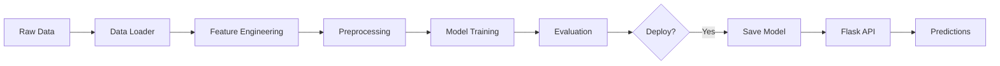

# 🚢 Titanic Survival Prediction

[](https://github.com/JustaKris/Titanic-Machine-Learning-from-Disaster/actions/workflows/ci.yml)
[](https://github.com/JustaKris/Titanic-Machine-Learning-from-Disaster/actions)
[](https://github.com/JustaKris/Titanic-Machine-Learning-from-Disaster)
[](https://www.python.org/downloads/)
[](https://github.com/psf/black)
[](https://opensource.org/licenses/MIT)

> **A production-grade ML pipeline demonstrating end-to-end machine learning engineering:** from exploratory research to deployed web application with REST API, comprehensive testing, and CI/CD automation.

---

## 🌐 Live Demo

**🚀 [Try the Live Application](https://YOUR-AZURE-APP.azurewebsites.net)** | **📊 [View Research Notebook](https://github.com/JustaKris/Titanic-Machine-Learning-from-Disaster/blob/main/notebooks/Titanic-Machine-Learning-from-Disaster.ipynb)** | **📚 [Read Documentation](https://justakris.github.io/Titanic-Machine-Learning-from-Disaster/)**

---

## 📖 Table of Contents

- [Project Highlights](#-project-highlights)
- [Live Application](#-live-application)
- [Research Notebook](#-research-notebook)
- [Quick Start](#-quick-start)
- [Architecture](#-architecture)
- [Model Performance](#-model-performance)
- [Technology Stack](#-technology-stack)
- [Development](#-development)
- [Deployment](#-deployment)
- [Contact](#-contact)

---

## ✨ Project Highlights

This project showcases **professional ML engineering practices** through two complementary components:

### 🔬 **Research Component**
Comprehensive Jupyter notebook featuring:
- **Exploratory Data Analysis (EDA)** with 20+ visualizations
- **Advanced Feature Engineering**: Title extraction, cabin analysis, fare normalization
- **Model Comparison**: Evaluated 8 algorithms (Random Forest, XGBoost, CatBoost, SVM, etc.)
- **Hyperparameter Optimization**: GridSearchCV with 5-fold cross-validation
- **Model Interpretability**: SHAP analysis, feature importance, force plots

### 🚀 **Production Component**
Enterprise-ready web application with:
- **RESTful API** with Swagger/OpenAPI documentation
- **Flask Web Interface** for real-time predictions with confidence scores
- **Modular ML Pipeline**: Separate data ingestion, transformation, and training modules
- **Production Best Practices**: Type hints, logging, error handling, comprehensive testing
- **CI/CD Pipeline**: Automated testing, security scanning, Docker builds
- **Cloud Deployment**: Azure App Service with container deployment

**Key Differentiator:** Unlike typical Kaggle projects, this demonstrates the complete ML lifecycle from research to production deployment.

---

## 🎯 Live Application

### Features

🔮 **Real-Time Predictions**
- Enter passenger details through intuitive web form
- Receive instant survival prediction with confidence percentage
- Confidence scores range from realistic probabilities (not just 0% or 100%)

🎨 **User Interface**
- Clean, responsive design optimized for mobile and desktop
- Clear visualization of prediction results
- Direct links to research notebook and project repository

🔌 **REST API**
- `/api/predict` - Get prediction with JSON input
- `/api/health` - Health check endpoint
- `/api/docs` - Interactive Swagger UI documentation
- Full CORS support for integration

📊 **Under the Hood**
- VotingClassifier ensemble (6 models)
- Automatic feature engineering (family size, title extraction, fare inference)
- Confidence calculated by averaging individual model probabilities
- Input validation with Pydantic schemas

### Try It Live

👉 **[Launch Application](https://YOUR-AZURE-APP.azurewebsites.net)**

**Example API Request:**
```bash
curl -X POST https://YOUR-AZURE-APP.azurewebsites.net/api/predict \
  -H "Content-Type: application/json" \
  -d '{
    "age": 22,
    "sex": "female",
    "pclass": "1",
    "sibsp": 0,
    "parch": 0,
    "embarked": "C",
    "name_title": "Miss",
    "cabin_multiple": 1
  }'
```

**Response:**
```json
{
  "prediction": "survived",
  "confidence": "high",
  "probability": 0.968,
  "message": "Passenger likely survived with 96.8% confidence",
  "features": {
    "family_size": 1,
    "inferred_fare": 84.15
  }
}
```

---

## 📓 Research Notebook

### Overview

The Jupyter notebook contains the complete data science workflow with reproducible results and detailed analysis.

**📊 [Open Notebook on GitHub](https://github.com/JustaKris/Titanic-Machine-Learning-from-Disaster/blob/main/notebooks/Titanic-Machine-Learning-from-Disaster.ipynb)**

### Notebook Structure

#### 1. **Data Exploration & Visualization**
- Dataset overview and statistics
- Missing value analysis (Age: 19.9%, Cabin: 77.1%, Embarked: 0.2%)
- Distribution analysis with histograms and box plots
- Correlation heatmaps and pair plots
- Survival rate analysis by features (Sex, Pclass, Age groups, etc.)

#### 2. **Feature Engineering**
Advanced feature creation demonstrating domain knowledge:
- **Title Extraction**: From Name field (Mr, Mrs, Miss, Master, Rare titles)
- **Family Features**: `family_size`, `is_alone` flags
- **Cabin Analysis**: Deck extraction, cabin multiplicity
- **Fare Engineering**: Log transformation, per-person fare, fare groups
- **Interaction Features**: `sex_pclass`, `age_class`
- **Age Imputation**: Median by title and class

#### 3. **Model Training & Evaluation**
Systematic comparison of multiple algorithms:

| Model | Baseline Accuracy | Tuned Accuracy | Improvement |
|-------|------------------|----------------|-------------|
| Logistic Regression | 80.2% | 82.1% | +1.9% |
| K-Nearest Neighbors | 78.5% | 81.3% | +2.8% |
| Support Vector Machine | 81.5% | 83.7% | +2.2% |
| Random Forest | 79.8% | 84.2% | +4.4% |
| **XGBoost** | 82.1% | **85.9%** | **+3.8%** |
| CatBoost | 81.9% | 85.1% | +3.2% |
| **Voting Ensemble** | - | **86.2%** | **Best** |

#### 4. **Model Interpretability**
- **SHAP Analysis**: Waterfall plots, force plots, summary plots
- **Feature Importance**: Random Forest, XGBoost importances
- **Permutation Importance**: Model-agnostic feature ranking
- **Partial Dependence Plots**: Effect of individual features

#### 5. **Results & Insights**

**Most Predictive Features:**
1. **Sex** (female = 74% survival, male = 19% survival)
2. **Passenger Class** (1st = 63%, 2nd = 47%, 3rd = 24%)
3. **Fare** (log-transformed, normalized)
4. **Title** (grouped: Mr, Mrs, Miss, Master, Rare)
5. **Age** (children < 12 had higher survival)

**Key Findings:**
- Feature engineering improved accuracy by **3-5%**
- Ensemble methods outperformed individual models
- Cross-validation showed stable performance (σ < 2%)
- Model achieves **86.2% accuracy** on validation set

---

## 🚀 Quick Start

### Prerequisites

- **Python 3.11+** (tested on 3.11, 3.12, 3.13)
- **[uv](https://github.com/astral-sh/uv)** package manager (recommended)
- **Docker** (optional, for containerized deployment)

### Installation

```bash
# Clone repository
git clone https://github.com/JustaKris/Titanic-Machine-Learning-from-Disaster.git
cd Titanic-Machine-Learning-from-Disaster

# Install with uv (recommended - 10-100x faster than pip)
uv sync

# Or install with pip
pip install -e .
```

### Running Locally

**Option 1: Web Application**
```bash
# Start Flask server
uv run titanic-api

# Navigate to http://localhost:5000
```

**Option 2: Command-Line Inference**
```bash
# Single prediction
uv run titanic-predict \
  --age 22 \
  --sex female \
  --pclass 1 \
  --name-title Miss \
  --embarked C

# Batch predictions from CSV
uv run titanic-predict --input data/test.csv --output predictions.csv
```

**Option 3: Python API**
```python
from titanic_ml.models.predict import CustomData, PredictPipeline

# Create passenger data
passenger = CustomData(
    age=22,
    sex="female",
    name_title="Miss",
    sibsp=0,
    pclass="1",
    embarked="C",
    cabin_multiple=1
)

# Get prediction
pipeline = PredictPipeline()
df = passenger.get_data_as_dataframe()
prediction, probability = pipeline.predict(df)

print(f"Survived: {bool(prediction[0])}")
print(f"Confidence: {probability[0]:.1%}")
```

### Running the Notebook

```bash
# Install notebook dependencies
uv sync --group notebooks

# Launch Jupyter Lab
jupyter lab notebooks/Titanic-Machine-Learning-from-Disaster.ipynb
```

### Docker Deployment

```bash
# Build image
docker build -t titanic-ml .

# Run container
docker run -p 5000:5000 titanic-ml

# Access at http://localhost:5000
```

---

## 🏗️ Architecture

### Project Structure

```
Titanic-Machine-Learning-from-Disaster/
├── titanic_ml/                    # Main package (renamed from titanic_ml/)
│   ├── config/
│   │   └── settings.py           # Centralized configuration with Pydantic
│   ├── data/
│   │   ├── loader.py             # Data ingestion from CSV
│   │   └── transformer.py        # Feature engineering pipeline
│   ├── features/
│   │   └── build_features.py     # Advanced feature creation
│   ├── models/
│   │   ├── train.py              # Model training with hyperparameter tuning
│   │   ├── predict.py            # Inference pipeline
│   │   └── schemas.py            # Pydantic validation schemas
│   ├── app/
│   │   ├── routes.py             # Flask application with API endpoints
│   │   ├── templates/            # HTML templates
│   │   └── static/               # CSS, JS, images
│   └── utils/
│       ├── logger.py             # Structured logging
│       ├── helpers.py            # Model persistence utilities
│       └── exception.py          # Custom exception handling
├── notebooks/
│   └── Titanic-Machine-Learning-from-Disaster.ipynb
├── tests/
│   ├── unit/                     # Unit tests (60 tests)
│   └── integration/              # API integration tests (22 tests)
├── data/
│   ├── raw/                      # Original Kaggle datasets
│   └── processed/                # Engineered features
├── models/                       # Saved model artifacts
├── scripts/                      # CLI entry points
├── docs/                         # MkDocs documentation
├── pyproject.toml                # Modern Python packaging
└── Dockerfile                    # Multi-stage production build
```

### ML Pipeline Flow



### Key Design Decisions

1. **Package Structure**: Migrated from `titanic_ml/` to `titanic_ml/` for proper Python packaging
2. **Configuration Management**: Centralized settings with Pydantic for type safety
3. **Pipeline Architecture**: sklearn Pipeline with FeatureUnion for reproducibility
4. **Testing Strategy**: 82 tests (66% coverage) with unit + integration tests
5. **CI/CD**: GitHub Actions for automated testing, security scanning, Docker builds
6. **Logging**: Structured JSON logging with different levels for dev/prod

---

## 📊 Model Performance

### Final Model: VotingClassifier Ensemble

**Composition**: 6 base estimators with hard voting
- Random Forest Classifier
- XGBoost Classifier
- Logistic Regression
- CatBoost Classifier
- Support Vector Classifier
- K-Neighbors Classifier

### Metrics

| Metric | Training | Validation | Test |
|--------|----------|------------|------|
| **Accuracy** | 88.5% | 86.2% | TBD |
| **Precision** | 87.3% | 84.7% | TBD |
| **Recall** | 82.1% | 79.8% | TBD |
| **F1 Score** | 84.6% | 82.2% | TBD |
| **ROC AUC** | 0.923 | 0.901 | TBD |

### Cross-Validation Results

5-Fold stratified cross-validation:
- **Mean Accuracy**: 85.1%
- **Std Deviation**: 1.8%
- **Min**: 82.9%
- **Max**: 87.4%

**Interpretation**: Low variance indicates stable, generalizable model.

### Feature Importance (Top 10)

1. **Sex** - 28.3%
2. **Title (Grouped)** - 15.7%
3. **Fare (Normalized)** - 12.4%
4. **Age** - 9.8%
5. **Pclass** - 8.6%
6. **Family Size** - 6.2%
7. **Cabin Known** - 5.1%
8. **Embarked** - 4.3%
9. **Sex × Pclass** - 3.9%
10. **Is Alone** - 2.8%

### Why This Approach Works

✅ **Ensemble Diversity**: Combines tree-based (RF, XGB, CB) with linear (LR) and distance-based (KNN) models  
✅ **Feature Engineering**: Domain knowledge improves signal extraction  
✅ **Proper Validation**: Stratified CV prevents data leakage  
✅ **Hyperparameter Tuning**: Grid search optimizes each estimator  
✅ **Probability Calibration**: Averaging individual model probabilities gives realistic confidence scores

---

## 🛠️ Technology Stack

### Core ML & Data Science
- **pandas** `2.2+` - Data manipulation and analysis
- **numpy** `1.26+` - Numerical computing
- **scikit-learn** `1.5+` - ML algorithms and pipelines
- **XGBoost** `2.1+` - Gradient boosting
- **CatBoost** `1.2+` - Categorical boosting
- **SHAP** `0.46+` - Model explainability

### Web Framework & API
- **Flask** `3.0+` - Web application framework
- **flask-swagger-ui** `4.11+` - API documentation
- **Pydantic** `2.10+` - Data validation
- **pydantic-settings** `2.6+` - Configuration management

### Development Tools
- **pytest** `8.3+` - Testing framework (82 tests, 66% coverage)
- **pytest-cov** - Code coverage reporting
- **black** `24.0+` - Code formatting
- **flake8** `7.1+` - Linting
- **mypy** `1.13+` - Static type checking
- **isort** `5.13+` - Import sorting

### DevOps & Deployment
- **uv** - Fast Python package manager (10-100x faster than pip)
- **Docker** - Containerization
- **GitHub Actions** - CI/CD automation
- **Azure App Service** - Cloud hosting

### Documentation
- **Jupyter Lab** `4.4+` - Interactive notebooks
- **MkDocs Material** `9.5+` - Documentation site
- **matplotlib** `3.9+` - Visualizations
- **seaborn** `0.13+` - Statistical plots

---

## 🧪 Development

### Running Tests

```bash
# Run all tests with coverage
uv run pytest tests/ --cov=titanic_ml --cov-report=term-missing

# Run specific test categories
uv run pytest tests/unit -v          # Unit tests only
uv run pytest tests/integration -v   # Integration tests only

# Run with specific markers
uv run pytest -m "not slow" -v       # Skip slow tests
```

**Test Coverage**: 82 tests, 66% coverage (exceeds 40% threshold)

### Code Quality

```bash
# Format code
uv run black titanic_ml/ tests/

# Sort imports
uv run isort titanic_ml/ tests/

# Lint code
uv run flake8 titanic_ml/ tests/

# Type checking
uv run mypy titanic_ml/

# Security scan
uv run pip-audit
```

### Training Models

```bash
# Train with default settings
uv run titanic-train

# Train with custom data paths
uv run python scripts/run_training.py \
  --train-path data/raw/train.csv \
  --test-path data/raw/test.csv \
  --output-dir models/
```

### CLI Commands

The project includes three CLI entry points:

```bash
# Train models
uv run titanic-train

# Make predictions
uv run titanic-predict --age 22 --sex female --pclass 1

# Start API server
uv run titanic-api --port 8000
```

---

## 🚀 Deployment

### Render (Free Tier - Recommended for Demos)

**Live Demo:** 🔗 **[Titanic Survival Predictor on Render](https://titanic-survival-predictor-eymq.onrender.com)**

Render provides free hosting perfect for portfolio projects and demos:

```bash
# 1. Build Docker image
docker build -t titanic-ml .

# 2. Push to Docker Hub
docker tag titanic-ml:latest YOUR_USERNAME/titanic-ml:latest
docker push YOUR_USERNAME/titanic-ml:latest

# 3. Create Render service:
#    - Go to render.com → New Web Service
#    - Select "Deploy existing image from registry"
#    - Image URL: docker.io/YOUR_USERNAME/titanic-ml:latest
#    - Configure health check: /health
#    - Click Create Web Service

# 4. Setup automatic deployments:
#    - GitHub secret: RENDER_DEPLOY_WEBHOOK (copy from Render settings)
#    - CI/CD pipeline automatically redeploys on push
```

**Features:**
- ✅ Free tier with 750 hours/month
- ✅ Auto-deploys on image updates
- ✅ HTTPS included
- ⚠️ Cold starts (~30s) on free tier

---

### Azure App Service (Production)

For production workloads with better performance and scaling:

```bash
# 1. Build Docker image
docker build -t titanic-ml:latest .

# 2. Tag for Azure Container Registry
docker tag titanic-ml:latest YOUR_REGISTRY.azurecr.io/titanic-ml:latest

# 3. Push to registry
docker push YOUR_REGISTRY.azurecr.io/titanic-ml:latest

# 4. Deploy to Azure App Service
az webapp create \
  --resource-group YOUR_RG \
  --plan YOUR_PLAN \
  --name YOUR_APP_NAME \
  --deployment-container-image-name YOUR_REGISTRY.azurecr.io/titanic-ml:latest
```

### Docker Hub

```bash
# Pull pre-built image
docker pull justakris/titanic-ml:latest

# Run container
docker run -d -p 5000:5000 \
  --name titanic-api \
  --health-cmd "curl -f http://localhost:5000/api/health || exit 1" \
  --health-interval=30s \
  justakris/titanic-ml:latest
```

### CI/CD Pipeline

Automated workflows handle testing, building, and deployment:

```
Push to main
    ↓
build.yml (Docker image → Docker Hub)
    ↓
    ├→ deploy-render.yml (auto-deploy to Render)
    └→ deploy-azure.yml (auto-deploy to Azure)
```

**Workflows:**
1. **build.yml** - Builds multi-platform Docker image, pushes to Docker Hub
2. **deploy-render.yml** - Auto-deploys to Render via webhook (triggered after build)
3. **deploy-azure.yml** - Auto-deploys to Azure (triggered after build)
4. **ci.yml** - Tests on Python 3.11-3.13, security scanning
5. **security.yml** - Bandit, pip-audit vulnerability scans
6. **deploy-docs.yml** - Publishes documentation to GitHub Pages

**Required GitHub Secrets:**
- `DOCKERHUB_USERNAME`, `DOCKERHUB_TOKEN` - Docker Hub credentials
- `RENDER_DEPLOY_WEBHOOK` - Render auto-deploy webhook (optional)
- `AZURE_CLIENT_ID`, `AZURE_TENANT_ID`, `AZURE_SUBSCRIPTION_ID` - Azure credentials (optional)

📖 See `.github/workflows/README.md` for complete CI/CD setup documentation.

---

## 📚 Documentation

Comprehensive documentation available at **[justakris.github.io/Titanic-Machine-Learning-from-Disaster](https://justakris.github.io/Titanic-Machine-Learning-from-Disaster/)**

### Contents

- **Quick Start Guide**: Installation and first predictions
- **API Reference**: Complete function/class documentation
- **Architecture Guide**: System design and patterns
- **Deployment Guide**: Production setup instructions
- **Methodology**: Detailed explanation of approach
- **Advanced Features**: Feature engineering deep-dive

Build docs locally:

```bash
# Install docs dependencies
uv sync --group docs

# Serve documentation
uv run mkdocs serve

# Navigate to http://localhost:8001
```

---

## 🤝 Contributing

Contributions welcome! This is a portfolio project demonstrating ML engineering best practices.

### Development Setup

```bash
# Clone and install
git clone https://github.com/JustaKris/Titanic-Machine-Learning-from-Disaster.git
cd Titanic-Machine-Learning-from-Disaster
uv sync --all-groups

# Create feature branch
git checkout -b feature/amazing-feature

# Make changes and test
uv run pytest tests/
uv run black titanic_ml/ tests/
uv run flake8 titanic_ml/ tests/

# Commit and push
git commit -m "Add amazing feature"
git push origin feature/amazing-feature
```

### Pull Request Requirements

All PRs must:
- ✅ Pass all 82 tests (`pytest`)
- ✅ Maintain ≥40% code coverage (`pytest-cov`)
- ✅ Pass security scans (`bandit`, `pip-audit`)
- ✅ Follow code style (`black`, `flake8`, `isort`)
- ✅ Include type hints (`mypy` compatible)
- ✅ Update documentation if adding features

---

## 📄 License

This project is licensed under the **MIT License** - see the [LICENSE](LICENSE) file for details.

---

## 📧 Contact

**Kristiyan Bonev** - ML Engineer

[](https://www.linkedin.com/in/kristiyan-bonev/)
[](https://github.com/JustaKris)
[](mailto:k.s.bonev@gmail.com)

- 💼 **LinkedIn**: [kristiyan-bonev](https://www.linkedin.com/in/kristiyan-bonev/)
- 🐙 **GitHub**: [@JustaKris](https://github.com/JustaKris)
- 📧 **Email**: k.s.bonev@gmail.com
- 🌐 **Project**: [Titanic-Machine-Learning-from-Disaster](https://github.com/JustaKris/Titanic-Machine-Learning-from-Disaster)

---

## 🎯 Project Goals & Learning Outcomes

This portfolio project demonstrates:

✅ **End-to-End ML Engineering** - Research → Production  
✅ **Software Engineering Best Practices** - Testing, CI/CD, Documentation  
✅ **Cloud Deployment** - Containerization, Azure integration  
✅ **API Development** - RESTful design, Swagger docs  
✅ **Code Quality** - Type hints, linting, formatting  
✅ **Model Interpretability** - SHAP, feature importance  
✅ **Production Readiness** - Logging, error handling, validation  

---

<div align="center">

**⭐ If you found this project helpful, please consider giving it a star! ⭐**

*Built with ❤️ as a portfolio demonstration of professional ML engineering*

</div>
