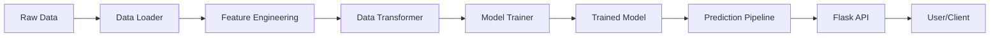
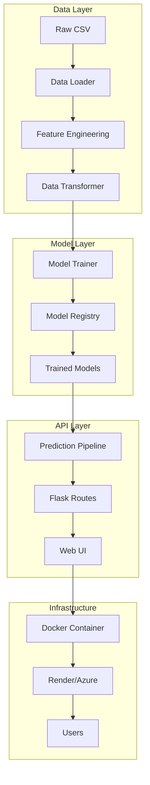

# Architecture Guide

Understanding the system design of the Titanic Survival Predictor.

---

## System Overview

The project follows a modular ML pipeline architecture with clear separation of concerns:



---

## Component Overview

### 1. Data Layer (`src/data/`)

**Purpose**: Load and manage raw datasets

- `loader.py` - Loads Kaggle CSV files, splits train/test
- `transformer.py` - Creates sklearn preprocessing pipelines

**Key Design Decisions**:
- Use pathlib for cross-platform compatibility
- Store processed data in `artifacts/` for reproducibility
- Separate loading from transformation for flexibility

### 2. Feature Layer (`src/features/`)

**Purpose**: Domain-specific feature engineering

- `build_features.py` - Creates derived features

**Features Created**:
- `cabin_multiple` - Number of cabins (wealth indicator)
- `name_title` - Extracted title (social status)
- `norm_fare` - Log-normalized fare (handles skewness)

**Why separate from transformation?**
- Feature logic is business/domain specific
- Transformations are generic sklearn operations
- Easier to test and modify independently

### 3. Model Layer (`src/models/`)

**Purpose**: Model training and inference

- `train.py` - Trains multiple models with GridSearchCV
- `predict.py` - Inference pipeline with preprocessing

**Key Features**:
- Model selection via cross-validation
- Hyperparameter tuning
- Ensemble methods (VotingClassifier)
- Model versioning and serialization

### 4. API Layer (`src/app/`)

**Purpose**: Serve predictions via web interface

- `routes.py` - Flask endpoints and form handling

**Endpoints**:
- `/` - Landing page
- `/prediction` - Prediction form and results
- `/health` - Health check for monitoring

### 5. Utilities (`src/utils/`)

**Common functionality shared across components**

- `logger.py` - Azure-ready structured logging
- `exception.py` - Custom exception handling
- `helpers.py` - Model persistence, evaluation

---

## Data Flow

### Training Pipeline

```python
# 1. Load raw data
loader = DataLoader()
train_path, test_path = loader.load_data()

# 2. Engineer features
train_df, num_cols, cat_cols = apply_feature_engineering(train_df)

# 3. Create preprocessor
transformer = DataTransformer()
X_train, y_train, X_test, y_test, preprocessor = transformer.transform_data(
    train_path, test_path
)

# 4. Train models
trainer = ModelTrainer()
best_model, score = trainer.train(X_train, y_train, X_test, y_test)

# Models saved to: models/model.pkl, models/preprocessor.pkl
```

### Prediction Pipeline

```python
# 1. Create input data
custom_data = CustomData(age=25, sex='female', ...)

# 2. Load pipeline
pipeline = PredictPipeline()

# 3. Make prediction
predictions, probabilities = pipeline.predict(
    custom_data.get_data_as_dataframe()
)
```

---

## Design Patterns

### 1. Pipeline Pattern

**Used in**: Data transformation and model training

```python
num_pipeline = Pipeline([
    ("imputer", SimpleImputer(strategy="median")),
    ("scaler", StandardScaler())
])
```

**Benefits**:
- Composable transformations
- Prevents data leakage
- Easy to serialize and deploy

### 2. Factory Pattern

**Used in**: Model creation

```python
def get_models(self) -> Dict[str, Any]:
    return {
        'Logistic Regression': LogisticRegression(...),
        'Random Forest': RandomForestClassifier(...),
        ...
    }
```

**Benefits**:
- Centralized model configuration
- Easy to add/remove models
- Consistent interface

### 3. Dependency Injection

**Used in**: Configurable paths

```python
class ModelTrainer:
    def __init__(self, model_path: Optional[Path] = None):
        self.model_path = model_path or MODEL_PATH
```

**Benefits**:
- Testable without file I/O
- Flexible configuration
- Supports different environments

---

## Configuration Management

All configuration centralized in `src/config/settings.py`:

```python
# Paths
PROJECT_ROOT = Path(__file__).parent.parent.parent
DATA_DIR = PROJECT_ROOT / "data"
MODEL_PATH = PROJECT_ROOT / "models" / "model.pkl"

# Model settings
CV_FOLDS = 5
RANDOM_STATE = 42

# Features
NUMERICAL_FEATURES = ['Age', 'SibSp', ...]
CATEGORICAL_FEATURES = ['Pclass', 'Sex', ...]
```

**Benefits**:
- Single source of truth
- Easy to modify
- Environment-specific configs

---

## Error Handling

Custom exception class with logging integration:

```python
try:
    result = risky_operation()
except Exception as e:
    logging.error(f"Operation failed: {e}")
    raise CustomException(e, sys)
```

**Features**:
- Preserves stack trace
- Structured logging
- Centralized error handling

---

## Logging Strategy

### Structured Logging

```python
logging.info(
    "Prediction completed",
    extra={'extra_fields': {
        'prediction': int(prediction),
        'probability': float(probability),
        'user_ip': request.remote_addr
    }}
)
```

**Benefits**:
- Queryable in Azure Application Insights
- Easy to filter and aggregate
- Production monitoring ready

### Log Levels

- **DEBUG**: Development debugging
- **INFO**: Normal operations, request tracking
- **WARNING**: Degraded functionality
- **ERROR**: Failures requiring attention

---

## Testing Strategy

### Unit Tests

Test individual functions in isolation:

```python
def test_cabin_multiple_creation():
    df = pd.DataFrame({'Cabin': ['A1', 'B1 B2', np.nan]})
    result = apply_feature_engineering(df)
    assert result['cabin_multiple'].tolist() == [1, 2, 0]
```

### Integration Tests

Test component interactions:

```python
def test_end_to_end_prediction():
    # Test full pipeline from input to prediction
    pass
```

---

## Deployment Architecture

### Local Development

```
┌─────────────┐
│  Developer  │
└──────┬──────┘
       │
       ▼
┌─────────────┐
│  Flask App  │ (localhost:5000)
│  + Models   │
└─────────────┘
```

### Docker Container

```
┌─────────────────────────────┐
│   Docker Container          │
│  ┌─────────────┐            │
│  │  Flask App  │            │
│  │  + Models   │            │
│  └──────┬──────┘            │
│         │                   │
│    Port 5000                │
└─────────┼───────────────────┘
          │
          ▼
     User Request
```

### Cloud Deployment (Render/Azure)

```
┌─────────────┐
│   GitHub    │
│  Repository │
└──────┬──────┘
       │ Push
       ▼
┌─────────────────┐
│ GitHub Actions  │ Build Docker Image
└──────┬──────────┘
       │
       ▼
┌─────────────────┐
│  Docker Hub /   │
│      ACR        │
└──────┬──────────┘
       │
       ▼
┌─────────────────┐
│  Render/Azure   │ Auto-deploy
│   Web Service   │
└──────┬──────────┘
       │
       ▼
   Public URL
```

---

## Scalability Considerations

### Current Limitations

- **Single instance**: No load balancing
- **In-memory models**: ~1GB RAM per instance
- **Synchronous API**: Blocks on long requests

### Scaling Options

#### Horizontal Scaling

```yaml
# docker-compose.yml
services:
  web:
    image: titanic-ml
    deploy:
      replicas: 3
  nginx:
    image: nginx
    # Load balancer config
```

#### Model as Service

Separate model serving:

```python
# Option 1: TensorFlow Serving
# Option 2: ONNX Runtime
# Option 3: Dedicated prediction service
```

#### Caching

Add Redis for frequent predictions:

```python
@cache.memoize(timeout=300)
def predict(features):
    return model.predict(features)
```

---

## Security Considerations

### Current Implementation

✅ Input validation (type checking)  
✅ No SQL injection (no database)  
✅ HTTPS in production (via platform)  
❌ No authentication  
❌ No rate limiting  
❌ No input sanitization

### Recommended Enhancements

1. **Add authentication**: JWT tokens or API keys
2. **Rate limiting**: Flask-Limiter
3. **Input validation**: Pydantic schemas
4. **CORS**: Restrict allowed origins
5. **Security headers**: Flask-Talisman

---

## Performance Optimization

### Current Performance

- Model loading: ~2-3s (startup)
- Prediction: ~10-50ms per request
- Memory: ~1GB (with models loaded)

### Optimization Opportunities

1. **Model Quantization**: Reduce model size
2. **Batch Predictions**: Process multiple at once
3. **Model Caching**: Keep in memory
4. **Async Predictions**: Use celery for long tasks

---

## Technology Choices

### Why Flask?

- ✅ Lightweight and simple
- ✅ Easy to deploy
- ✅ Good for MVP
- ❌ Not async by default
- ❌ Less features than FastAPI

**Alternative**: FastAPI for production scale

### Why sklearn?

- ✅ Industry standard
- ✅ Excellent documentation
- ✅ Easy model persistence
- ✅ Compatible with most ML algorithms

### Why Docker?

- ✅ Consistent environments
- ✅ Easy deployment
- ✅ Platform agnostic
- ✅ Resource isolation

---

## Future Improvements

See [Recommendations Document](../RECOMMENDATIONS.md) for detailed suggestions:

1. Model monitoring and drift detection
2. Model versioning system
3. A/B testing framework
4. Explainability dashboard
5. Comprehensive test suite

---

## Diagram: Full System



---

## Questions?

- Review [API Reference](../reference/api.md)
- Check [Deployment Guide](deployment.md)
- See [Contributing Guide](contributing.md)
