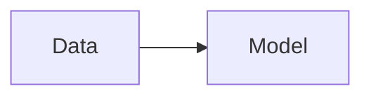

# Documentation Guide

This project uses **MkDocs** with the **Material** theme to generate documentation from markdown files.

## Quick Reference

### View Documentation Locally

```bash
# Install documentation dependencies
uv sync --group docs

# Serve docs with live reload
uv run mkdocs serve

# Use custom port
uv run mkdocs serve --dev-addr localhost:8001
```

Open <http://localhost:8001> in your browser. Changes auto-reload!

### Build Static Site

```bash
# Build HTML to site/ folder
uv run mkdocs build

# Clean build
uv run mkdocs build --clean
```

### Deploy to GitHub Pages

The project has automated deployment via GitHub Actions. Manual deployment:

```bash
uv run mkdocs gh-deploy
```

## Project Structure

```
Titanic-Machine-Learning-from-Disaster/
├── docs/                    # Documentation files
│   ├── index.md            # Homepage
│   ├── guides/             # Getting started guides
│   ├── reference/          # API reference
│   ├── explanations/       # Methodology & features
│   ├── technical/          # Technical details
│   ├── stylesheets/        # Custom CSS
│   └── javascripts/        # Custom JS (MathJax)
├── mkdocs.yml              # MkDocs configuration
└── site/                   # Generated HTML (not committed)
```

## Adding/Editing Documentation

### Edit Existing Pages

Edit any `.md` file in `docs/`. If `mkdocs serve` is running, changes appear instantly.

### Add New Pages

**Step 1:** Create markdown file:

```bash
New-Item docs/guides/my-guide.md
```

**Step 2:** Add to `mkdocs.yml` navigation:

```yaml
nav:
  - Guides:
      - My Guide: guides/my-guide.md
```

**Step 3:** Preview with `mkdocs serve`.

## Markdown Features

### Admonitions

```markdown
!!! note
    This is a note.

!!! warning
    This is a warning.
```

### Code Blocks

````markdown
```python
def hello():
    print("Hello")
```
````

### Tables

```markdown
| Feature | Status |
|---------|--------|
| Search  | ✅     |
```

### Mermaid Diagrams

````markdown

````

## Custom Styling

The `docs/stylesheets/` and `docs/javascripts/` folders contain:

- **extra.css** - Custom styling for tables, cards, buttons
- **mathjax.js** - Mathematical formula rendering (useful for ML docs)

These are referenced in `mkdocs.yml`:

```yaml
extra_css:
  - stylesheets/extra.css

extra_javascript:
  - javascripts/mathjax.js
```

**Note:** These are standard MkDocs Material customizations and should remain.

## CI/CD Deployment

Documentation deploys automatically when you push to `main` with changes in `docs/` or `mkdocs.yml`.

See `.github/workflows/deploy-docs.yml` for configuration.

## Resources

- **MkDocs:** <https://www.mkdocs.org/>
- **Material Theme:** <https://squidfunk.github.io/mkdocs-material/>
- **Live Docs:** <https://justakris.github.io/Titanic-Machine-Learning-from-Disaster/>
